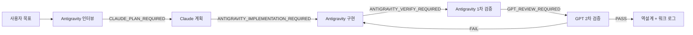

# 2026-08-08 Orca 중심 글로벌 AI 작업방식 운영 매뉴얼

## 1. 이 문서의 목적

이 문서는 WIDEN 프로젝트와 회사 컴퓨터의 새 프로젝트에서 같은 작업방식을 재현하기 위한 운영 기준이다.

핵심 흐름은 다음과 같다.



Orca는 전체 작업을 지휘하고, Claude는 계획을 세우며, Antigravity는 구현과 1차 검증을 담당하고, GPT는 독립적인 2차 검증을 담당한다. Paseo는 이 운영에 필수가 아니며, 같은 프로젝트에서 Orca와 동시에 작업 관리자로 사용하지 않는다.

## 2. 한 번만 하는 설정과 매번 하는 일

### 프로젝트마다 한 번

새 저장소를 만들거나 회사 컴퓨터에서 저장소를 처음 열 때만 실행한다.

```powershell
powershell -ExecutionPolicy Bypass -File `
"C:\Users\Sungsu Lee\Desktop\위든_뷰티\K뷰티_DashBoard_260704\widen_cosmetic-live\tools\init-ai-workflow.ps1" `
-TargetPath "C:\프로젝트\새프로젝트"
```

이 명령은 `AGENTS.md`, `docs/ai/WORKFLOW.md`, 모델 라우팅, Handoff·검증 템플릿을 만든다. 기존 파일은 기본적으로 덮어쓰지 않는다. 기존 프로젝트에 `-Force`를 사용하지 않는다.

### 작업마다 한 번

Orca에서 목표와 완료 기준만 입력한다.

```text
작업 시작: <구체적인 목표>
저장소: <GitHub 저장소>
브랜치: codex/<task-id>
완료 기준: <사용자가 실제로 확인할 수 있는 결과>
```

글로벌 지침은 저장소의 `AGENTS.md`와 `docs/ai`가 읽는다. 사용자는 매번 전체 프로토콜을 반복해서 입력하지 않는다.

## 3. Orca 화면에서 어디에 입력하는가

Orca 화면에 Antigravity CLI의 `>` 입력창이 보이면 그곳이 현재 에이전트에게 작업 지시를 넣는 곳이다.

- 왼쪽 `Done - Claude`: Claude가 이미 끝낸 작업의 기록 또는 에이전트 카드
- 가운데 `>`: 현재 Antigravity CLI에 구현·검증 지시를 입력하는 창
- 오른쪽 파일 영역: 저장소 파일 확인 영역
- `설정 스크립트 추가`: 작업 지시가 아니라 새 worktree 생성 직후 실행할 초기화 스크립트 설정

Claude의 결과를 Antigravity가 자동으로 아는 것이 아니라, Claude가 계획과 Handoff를 GitHub 브랜치에 기록하고 Antigravity가 그 파일을 읽는다.

## 4. 단계별 운영 규칙

### 4.1 Antigravity 인터뷰

Orca에서 Antigravity의 `>` 창에 다음을 입력한다.

```text
이 저장소의 AGENTS.md와 docs/ai 문서를 먼저 읽어줘.

이번 작업의 사용자 목표를 인터뷰하고 다음 내용을 정리해줘.
- 사용자가 실제로 확인할 결과
- 포함 범위와 제외 범위
- 완료 기준
- 데이터·인증·배포 위험
- 추가로 반드시 결정해야 하는 질문

코드는 아직 작성하지 말고,
docs/ai/handoffs/<task-id>.yaml에 인터뷰 결과를 기록해줘.
Handoff 상태는 CLAUDE_PLAN_REQUIRED로 설정해줘.
```

### 4.2 Claude 계획

Orca의 Claude 카드 또는 Claude 터미널에 다음 signal을 보낸다.

```text
SIGNAL: CLAUDE_PLAN_REQUIRED
TASK_ID: <task-id>

Antigravity의 Handoff와 docs/ai/project.yaml을 읽어줘.
사용자에게 이미 답을 받은 질문은 다시 묻지 말고,
중요도·난이도·위험에 따라 모델과 추론 강도를 추천해줘.

docs/ai/plans/<date>-<task-id>.md에 다음을 작성해줘.
- 목표와 완료 기준
- 설계와 데이터 흐름 Mermaid
- 구현 순서
- 테스트와 브라우저 검증 방법
- 위험과 롤백

코드는 작성하지 말고 완료 후 Handoff 상태를
ANTIGRAVITY_IMPLEMENTATION_REQUIRED로 변경해줘.
```

### 4.3 Antigravity 구현

Antigravity `>` 창에 다음을 입력한다.

```text
SIGNAL: ANTIGRAVITY_IMPLEMENTATION_REQUIRED
TASK_ID: <task-id>

Claude 계획과 Handoff를 읽고 승인된 범위만 구현해줘.
기존 구조와 저장소 패턴을 우선 사용하고 무관한 리팩터링은 하지 마.
테스트와 필요한 브라우저 검증을 직접 실행하고,
변경 파일·실행 명령·남은 위험을 Handoff에 기록해줘.
완료 후 Handoff 상태를 ANTIGRAVITY_VERIFY_REQUIRED로 변경해줘.
```

### 4.4 Antigravity 1차 검증

```text
SIGNAL: ANTIGRAVITY_VERIFY_REQUIRED
TASK_ID: <task-id>

자동 테스트, 로컬 또는 Preview 브라우저, 모바일 폭을 검증해줘.
docs/ai/verification/<task-id>.md에 실제 결과를 기록해줘.
검증하지 못한 항목은 UNVERIFIED 또는 BLOCKED로 표시해줘.
모든 로컬 검증이 끝나면 Handoff 상태를 GPT_REVIEW_REQUIRED로 변경해줘.
```

### 4.5 GPT 2차 검증

이 단계는 이 대화에서 실행한다.

```text
검증 시작: <task-id>

GitHub 현재 브랜치의 Handoff, diff, 테스트 결과, 브라우저 검증 결과를 읽어줘.
버그·회귀·보안·데이터 손실 위험을 Findings 먼저 작성하고,
PASS, PARTIAL_PASS, FAIL, BLOCKED 중 하나로 판정해줘.
docs/ai/reviews/<task-id>.md에 기록해줘.
```

## 5. Signal은 자동인가, 수동인가

작업 계약에는 signal 상태가 이미 정의되어 있지만, Orca CLI가 현재 컴퓨터의 PATH에 연결되지 않았다면 단계 전환은 수동이다. 이때 사용자는 긴 프롬프트가 아니라 다음처럼 한 줄만 보내면 된다.

```text
계속 진행: <task-id>
```

Orca 자동화가 연결되면 Handoff의 상태 변경을 기준으로 다음 에이전트를 호출할 수 있다. 자동화가 실제로 실행됐다는 증거가 없으면 `AUTOMATIC`으로 표시하지 않고 `UNVERIFIED`로 기록한다.

## 6. 회사 컴퓨터 재현 절차

1. Git, Node.js, Python, Antigravity, Claude, Orca를 설치하고 각 계정에 로그인한다.
2. GitHub 저장소를 clone한다.
3. 다음을 확인한다.

```powershell
git rev-parse --show-toplevel
git remote -v
git branch --show-current
```

4. `origin`이 올바른 GitHub 저장소를 가리키고, 작업 브랜치가 의도한 브랜치인지 확인한다.
5. WIDEN 저장소의 `tools/init-ai-workflow.ps1`로 새 프로젝트에 작업 계약을 설치한다.
6. Orca에서 해당 폴더를 Project/worktree로 연다.
7. Orca의 `설정 스크립트 추가`에는 작업 프롬프트나 Claude signal을 넣지 않는다. 이 칸은 새 worktree 생성 직후 실행되는 초기화 스크립트다.
8. 화면 예시처럼 shell 스크립트를 사용하는 경우 아래 내용을 설정 스크립트 칸에 넣고, `agent를 시작하기 전에 설정이 완료될 때까지 기다리세요`를 켠다.

```sh
set -eu
cd "$ORCA_WORKTREE_PATH"

mkdir -p docs/ai/plans docs/ai/handoffs docs/ai/verification docs/ai/reviews docs/ai/learning

if [ -f pnpm-lock.yaml ]; then
  pnpm install --frozen-lockfile
elif [ -f package-lock.json ]; then
  npm ci
elif [ -f yarn.lock ]; then
  yarn install --frozen-lockfile
fi

if [ -f requirements.txt ]; then
  python -m pip install -r requirements.txt
fi

printf '%s\n' "AI Work OS bootstrap complete: $ORCA_WORKSPACE_NAME"
```

이 WIDEN 정적 JavaScript 프로젝트에는 `package.json`과 `requirements.txt`가 없으므로 의존성 설치 단계는 자동으로 건너뛰고, 문서 폴더만 준비한다. `.env` 복사나 Supabase migration 실행은 이 프로젝트의 공개 설정과 현재 운영 상태를 덮어쓸 수 있으므로 자동화하지 않는다.

9. `python -m http.server 4173`은 초기화 스크립트에 넣지 않는다. 필요할 때 별도 개발 서버/서비스 스크립트로 실행한다.
10. 처음에는 한 작업을 수동 signal로 끝까지 통과시킨 뒤 자동화를 켠다.

## 7. 현재 WIDEN 파일럿 상태

- Repository: `sungsulee1190-star/widen_cosmetic`
- Branch: `codex-trend-intelligence-loop`
- Orchestrator: Orca only
- Planning: Claude
- Implementation and first verification: Antigravity
- Second verification: GPT
- Handoff: `docs/ai/handoffs/shared-storage-pilot.yaml`
- Verification: `docs/ai/verification/shared-storage-pilot-antigravity.md`

현재 Codex 셸에서는 `orca` CLI가 PATH에 연결되어 있지 않다. Orca 앱이 설치되어 있어도 CLI 연결이 별도일 수 있으므로, Orca 내부 터미널에서 버전별 가이드를 먼저 확인한다.

```text
orca skills get orca-cli
orca status --json
```

CLI가 연결되기 전까지는 저장소 Handoff와 수동 signal 방식이 기준이다.

## 8. 운영 원칙

- Orca와 Paseo가 같은 worktree를 동시에 관리하지 않는다.
- 사용자 승인 없이 `main`에 merge하지 않는다.
- 인증키, service role 키, 비밀번호를 저장소에 넣지 않는다.
- 완료 판정은 문서가 아니라 재현 가능한 테스트와 브라우저 결과로 한다.
- 회사 컴퓨터와 개인 컴퓨터는 GitHub 브랜치와 `docs/ai`를 공유 기준으로 사용한다.

