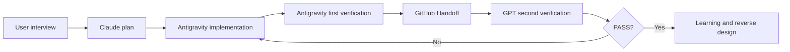

# Global AI Work OS Workflow

이 문서는 새 프로젝트와 기존 프로젝트에 공통으로 적용하는 작업 흐름입니다.

## Flow

## Stage contract

| Stage | Owner | Input | Required output | Stop condition |
| --- | --- | --- | --- | --- |
| Interview | User + AI | desired outcome and constraints | brief, acceptance checks, open questions | goal is still ambiguous |
| Plan | Claude | brief and repository context | plan, diagrams, risk, model/reasoning recommendation | user has not approved scope |
| Implement | Antigravity | approved plan and branch | code, focused tests, changed-file summary | acceptance checks are not implementable |
| First verification | Antigravity | implementation and local/Preview URL | test output, browser checks, failure list | environment or account is unavailable |
| Handoff | Implementation agent | verification evidence | YAML with branch, files, risks, next action | another agent cannot reproduce the state |
| Second verification | GPT | Handoff, diff, evidence | findings first, residual risk, decision | production evidence is missing for a critical path |
| Learning | GPT + user | accepted result | code map, data flow, work log, reuse recipe | user cannot explain how to repeat it |

## Handoff rules

- Use one `task_id` across every file and message.
- Commit the Handoff with the implementation so another tool can start from GitHub.
- Keep the Handoff under 60 lines when possible. Link to detailed documents instead of copying them.
- Record facts separately from assumptions. Mark unverified external systems as `UNVERIFIED`.
- The next action must be a single executable sentence.

## Verification levels

- `PASS`: acceptance checks passed with evidence.
- `FAIL`: a reproducible defect remains.
- `BLOCKED`: the code may be ready, but an external dependency prevents verification.
- `PARTIAL_PASS`: local checks pass while a production or cross-device check remains.

## Conversation protocol

The user should not need to repeat project context between tools. Each agent reads the latest Handoff and writes only its own stage result. The user only decides scope, priority, risk acceptance, and whether to merge production changes.

This workflow can standardize files and prompts, but it cannot wake a separate application automatically unless that application exposes a webhook or automation event. Until then, the GitHub Handoff file is the synchronization point.

