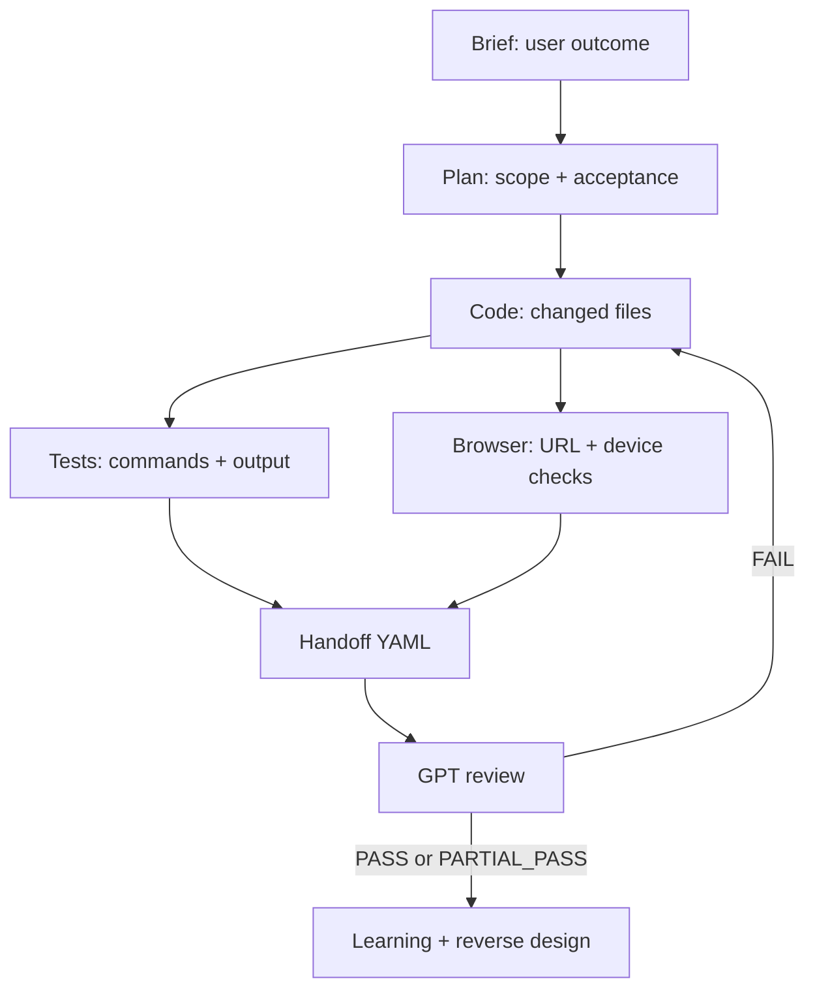

# Agent Handoff Graph

## Required links at each edge

| Edge | Artifact |
| --- | --- |
| Brief -> Plan | `docs/ai/plans/<date>-<task>.md` |
| Plan -> Code | approved branch and acceptance checks |
| Code -> Tests | test command and captured output |
| Code -> Browser | preview/local URL, viewport, console result |
| Tests/Browser -> Handoff | `docs/ai/handoffs/<task>.yaml` |
| Handoff -> Review | `docs/ai/reviews/<task>.md` |
| Review -> Learning | `docs/ai/learning/<task>/` and `work-log.md` |

