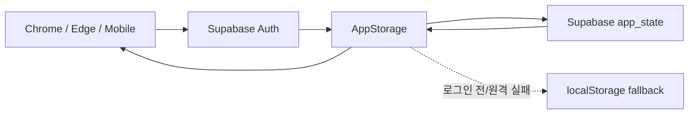

# 02. 변경 전후 흐름

## 변경 전

```mermaid
flowchart LR
    B["Chrome / Edge / Mobile"] --> L["각 브라우저 localStorage"]
    L --> U["브라우저마다 다른 상태"]
```

## 변경 후

```mermaid
flowchart LR
    B["Chrome / Edge / Mobile"] --> A["Supabase Auth"]
    A --> S["AppStorage"]
    S --> D["Supabase app_state"]
    S -. "로그인 전/원격 실패" .-> L["localStorage fallback"]
    D --> S
    S --> B
```

## 판단 기준

화면에 `공용 저장소 연결됨`이 보이면 원격 상태를 읽고 쓸 수 있는 상태다. `로그인 필요` 또는 `로컬 저장 모드`가 보이면 브라우저별 상태일 수 있으므로 중요한 변경 전에 로그인 상태를 확인한다.
