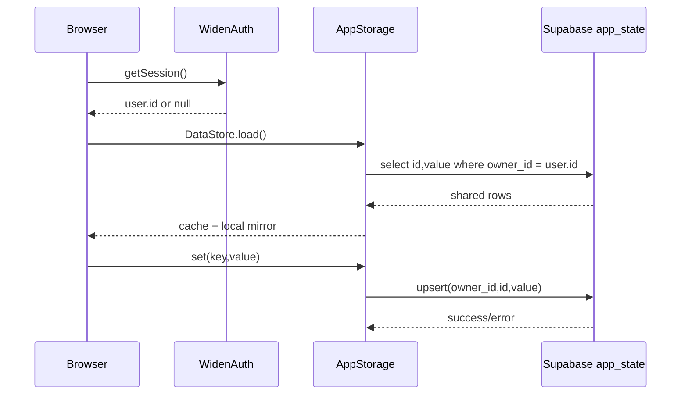

# 04. 데이터 흐름

```mermaid
sequenceDiagram
    participant U as Browser
    participant AU as WidenAuth
    participant AS as AppStorage
    participant DB as Supabase app_state

    U->>AU: getSession()
    AU-->>U: user.id or null
    U->>AS: DataStore.load()
    AS->>DB: select id,value where owner_id = user.id
    DB-->>AS: shared rows
    AS-->>U: cache + local mirror
    U->>AS: set(key,value)
    AS->>DB: upsert(owner_id,id,value)
    DB-->>AS: success/error
```

`owner_id`는 클라이언트가 임의로 다른 사용자의 행을 읽지 못하게 하는 식별자다. 실제 권한은 데이터베이스 RLS가 결정한다.
