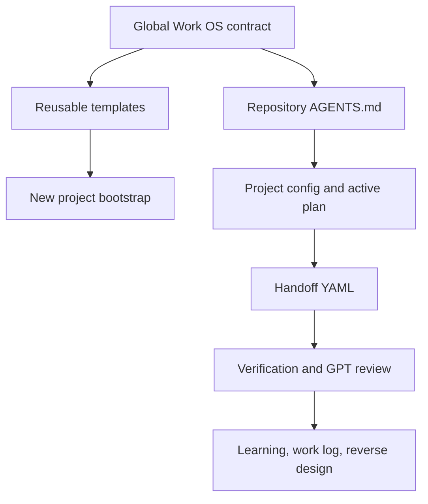

# Global AI Work OS Adoption Plan

- Task ID: `global-workflow-adoption`
- Importance: `P1`
- Difficulty: `3/5`
- Recommended plan model/reasoning: `Claude / high`
- Implementation owner: `Codex`
- Verification owner: `GPT`

## User outcome

새 프로젝트와 기존 프로젝트에서 사용자가 같은 방식으로 인터뷰, 계획, 구현, 1차 검증, GPT 2차 검증, 역설계를 반복할 수 있다.

## Acceptance checks

- [x] 현재 저장소에 `AGENTS.md`가 있고 작업 계약을 안내한다.
- [x] `docs/ai`에 프로젝트 설정, 작업 흐름, 모델 라우팅, Handoff/검증 템플릿이 있다.
- [x] 새 저장소에 템플릿을 복사하는 초기화 스크립트가 있다.
- [x] Mermaid 작업 흐름과 코드 Handoff 그래프가 있다.
- [x] 현재 공유저장소 파일럿 Handoff가 공통 스키마를 참조한다.
- [ ] Antigravity가 실제로 이 계약을 읽고 1차 검증 결과를 기록한다.

## Architecture

## Scope

### In scope

- reusable repository-level workflow contract
- stage-specific model and reasoning routing
- compact artifacts for plans, Handoffs, verification, reviews, work logs, and decisions
- PowerShell bootstrap script for new repositories

### Out of scope

- automatic wake-up of an external Antigravity application
- forced replacement of an existing repository `AGENTS.md`
- production deployment or automatic merge to `main`

## Rollback

Remove the newly added workflow files and leave application runtime code unchanged. The bootstrap script is additive and does not overwrite existing files unless `-Force` is supplied.

