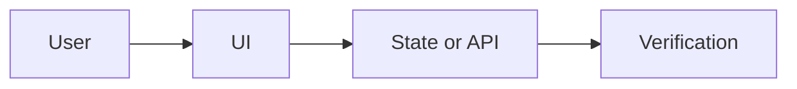

# Plan: replace task title

- Task ID: `replace-with-task-id`
- Importance: `P1`
- Difficulty: `3/5`
- Recommended model/reasoning: `Claude / high`
- Branch: `codex/replace-with-branch`

## User outcome

State the result the user should observe.

## Acceptance checks

- [ ] Observable check one
- [ ] Observable check two

## Scope

### In scope

-

### Out of scope

-

## Design and data flow

## Implementation sequence

1. 
2. 
3. 

## Risks and rollback

- Risk:
- Rollback:

