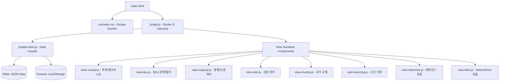

# WIDEN K-Beauty Dashboard 시스템 설계 구조 (Architecture)

본 문서는 WIDEN K-Beauty SKU Intelligence 대시보드의 현재 설계 구조와 데이터 흐름에 대해 설명합니다. 이 프로젝트는 의존성을 최소화하고 브라우저 환경에서 경량으로 구동되는 **Vanilla SPA(Single Page Application)** 아키텍처를 채택하고 있습니다.

---

## 1. 시스템 아키텍처 개요

대시보드는 웹 서버가 없는 환경에서도 완벽히 작동하는 클라이언트 중심 구조입니다. 외부 API 연동 없이 로컬 데이터와 저장소를 유기적으로 연결하여 데이터를 실시간으로 필터링하고 영속화합니다.

---

## 2. 레이어별 설계 구조

### 1) Presentation Layer (뷰 레이어)
*   **구조**: `index.html`에는 각 뷰에 매핑되는 `<section class="view-section">` 태그만 뼈대로 존재하며, 실제 마크업과 컴포넌트 렌더링은 각 `view-*.js` 파일 내 전역 함수가 동적으로 제어합니다.
*   **라우팅 기법**: 
    *   `js/app.js`에서 클릭 이벤트를 감지하여 활성화된 섹션에만 `.active` 클래스를 부여하고 나머지는 숨김 처리합니다.
    *   화면 전환 시마다 `VIEW_RENDERERS` 맵에 선언된 개별 뷰 렌더링 함수(예: `renderSkuView()`)를 호출하여 화면을 동적으로 다시 그립니다.
    *   마지막으로 보고 있던 뷰의 ID는 브라우저 `localStorage`(`widen-last-view`)에 기록되어, 페이지 새로고침 시에도 기존 화면이 유지됩니다.

### 2) Business & Data Layer (데이터 통제)
*   **`DataStore` 객체 (`js/data-store.js`)**:
    *   **정적 데이터 처리**: 앱 로딩 시 `data/` 디렉터리에 위치한 9개의 JSON 파일들을 `fetch` API를 사용하여 비동기로 한 번에 로드하고 전역 변수에 적재합니다.
    *   **동적 상태 제어**: 사용자가 입력하는 체크리스트 체크 여부, SKU 즐겨찾기 상태(❤️), 오프라인 매장 방문 로그 등은 `localStorage`에 JSON 형태로 즉시 영속화되어 브라우저가 종료되어도 정보가 손실되지 않습니다.

### 3) Design System (CSS 스타일링)
*   **`css/style.css`**:
    *   **CSS Custom Variables**: 테마 컬러, 간격, 트랜지션, 사이드바 크기 등을 토큰 형태로 중앙 관리하여 일관성 있는 미학을 제공합니다.
    *   **반응형 레이아웃**: 데스크톱 뷰에서는 `flex-direction: row` 및 다열 그리드(`grid-4`, `grid-3`)로 표시되며, 모바일 환경(1024px 이하)에서는 사이드바가 가로 횡스크롤 메뉴로 전환되고 본문 그리드가 1열/2열로 유연하게 늘어납니다.

---

## 3. 데이터 모델 (Data Schema)

대시보드에서 활용하는 주요 데이터 구조 파일 목록입니다:

1.  **`sku-list.json`**: 등록된 상품 리스트 (도매가, 판매가, 브랜드, 카테고리, 성분 태그 등 마스터 스펙).
2.  **`weekly-uploads.json`**: 요일별 데일리 업로드 플래너 데이터 및 일별 작업 체크리스트.
3.  **`weekly-trends.json`**: 트렌드 상품의 SWOT 분석(강점, 단점, 리스크 요인).
4.  **`season-calendar.json`**: 계절성 타겟팅 카테고리 및 지난 연도 동월 판매 랭킹 데이터.
5.  **`countries.json`**: 일본 약기법 및 대만 PIF 법안 관련 상세 주의사항 가이드라인.
6.  **`copycat-shops.json`**: 벤치마킹할 Qoo10의 메이저 편집샵들의 강점/약점 분석표.
7.  **`sourcing-routes.json`**: 정기적인 오프라인 시장조사 루트 템플릿.

---

## 4. 아키텍처 특장점 및 확장 방향
*   **서버리스 단순성**: 서버 리소스가 없어도 로컬 파일 실행(`double-click`) 혹은 간이 정적 서버 환경에서 완전하게 동작합니다.
*   **향후 데이터베이스 연동 확장성**: 현재의 `DataStore` 객체는 파사드 패턴(Facade Pattern)으로 구현되어 있어, 추후 `fetch` 부분만 **Supabase** 또는 **Firebase** SDK로 대체하면 손쉽게 멀티 유저 DB 기반 대시보드로 무중단 마이그레이션이 가능합니다.
