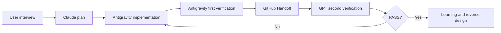

# Global AI Work OS Workflow

Use this stage order for every project:

| Stage | Required output | Stop condition |
| --- | --- | --- |
| Interview | brief, acceptance checks, open questions | goal is ambiguous |
| Plan | scope, diagrams, risk, model/reasoning recommendation | user has not approved scope |
| Implement | code, focused tests, changed-file summary | acceptance checks are not implementable |
| First verification | test output, browser checks, failure list | environment is unavailable |
| Handoff | YAML with branch, files, risks, next action | another agent cannot reproduce the state |
| Second verification | findings first, residual risk, decision | critical production evidence is missing |
| Learning | code map, data flow, work log, reuse recipe | user cannot repeat the task |

## Handoff rules

- Use one `task_id` across every file and message.
- Commit the Handoff with the implementation.
- Keep Handoff files short and link to detailed documents.
- Mark unverified external systems as `UNVERIFIED`.
- Make `next_action` one executable sentence.

The GitHub Handoff file is the synchronization point when an external tool cannot emit a completion webhook.

